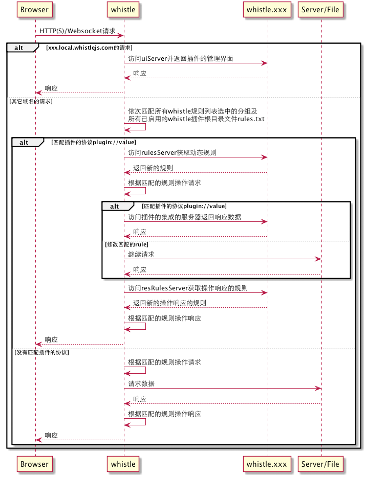

# 插件开发

有些功能用的比较少的功能，及一些跟业务相关的功能，如：

- 查看websocket的传输内容 
- 查看如图片等富媒体资源
- 集成一些本地服务(处理[combo请求](https://github.com/whistle-plugins/whistle.tianma))
- 动态设置规则(通过远程服务器动态判断请求设置哪些规则)
- 加载本地指定的规则文件

等等，考虑到会导致安装过程比较长或者占用内存空间或者适应范围比较小，whistle没有把这些功能加进去，但提供了插件的方式扩展这些功能。

whistle插件本身就是一个普通的Node模块，只是名字要按照`whistle.xxx`的形式命名，其中`xxx`指插件的名称且只能包含小写字母、数字、_、-四种字符，如：[whistle.helloworld](https://github.com/whistle-plugins/whistle.helloworld)、[whistle.tianma](https://github.com/whistle-plugins/whistle.tinama)、[whistle.vase](https://github.com/whistle-plugins/whistle.vase)，而`xxx`就是扩展的协议，可以直接在Rules里面配置使用，我们先看下whistle的时序图及插件的结构，了解whistle如何加载执行插件，然后再讲下如何开发、发布、安装插件。

whistle的时序图：

### 编写插件

whistle插件目录结构：

	whistle.xxx
		|__ package.json
		|__ rules.txt
		|__ _rules.txt
		|__ index.js
		|__ lib
			  |__ uiServer.js
			  |__ statusServer.js
			  |__ rulesServer.js
			  |__ server.js
			  |__ resRulesServer.js
			  
除了package.json，其它都是可选的，其中(参考时序图)：

- package.json

		{
		    "name": "whistle.xxx",
		    "version": "0.0.1",
		    "description": "xxxx",
		    "homepage": "插件的帮助或官网链接",
		    //others
		}

- rules.txt: 插件的全局规则，只要插件启用，所有请求都会查找匹配
- _rules.txt: 插件的私有规则，只有请求匹配插件的规则`xxx://value`，才会去查找匹配
- index.js

		module.exports = require('./lib/server');
		module.exports.uiServer = require('./lib/uiServer');
		module.exports.rulesServer = require('./lib/rulesServer');
		module.exports.resRulesServer = require('./lib/resRulesServer');

- lib/uiServer: `xxx.local.whistlejs.com`域名下的请求都会直接访问该server，可用于后台管理界面

		module.exports = function(server, options) {
			/*
			* options包含一些自定义的头部字段名称及配置信息，后面单独统一讲
			* server是whistle传给插件的http.Server对象，
			* 开发者通过监听server的相关事件处理ui相关的请求(http或websocket)
			*/
		};

- lib/statusServer: 状态服务器，whistle会把请求的各种状态post过来，请求只要匹配了插件的协议规则`xxx://value或plugin://xxx(value)`(`xxx`为插件`whistle.xxx`的名称)

		module.exports = function(server, options) {
			/*
			* options包含一些自定义的头部字段名称及配置信息，后面单独统一讲
			* server是whistle传给插件的http.Server对象，
			* 开发者通过监听server的request事件获取请求信息，
			* 并返回新的规则
			*/
		};

- lib/rulesServer: 规则服务器，请求只要匹配了插件的协议规则`xxx://value或plugin://xxx(value)`(`xxx`为插件`whistle.xxx`的名称)，就会把一些请求带放在头部请求该server，该server可以根据需要返回新的规则

		module.exports = function(server, options) {
			/*
			* options包含一些自定义的头部字段名称及配置信息，后面单独统一讲
			* server是whistle传给插件的http.Server对象，
			* 开发者通过监听server的request事件获取请求信息，
			* 并返回新的规则
			*/
		};
	
- lib/server: 处理请求的server，可以做请求合并等，返回的数据就是请求的响应数据

		module.exports = function(server, options) {
			/*
			* options包含一些自定义的头部字段名称及配置信息，后面单独统一讲
			* server是whistle传给插件的http.Server对象，
			* 开发者通过监听server的相关事件处理whistle转发过来的请求
			*/
		};

- lib/resRulesServer: 响应规则服务器，在请求响应后到达浏览器前whistle会把一些请求信息传给该server，该server可以返回新的规则

		module.exports = function(server, options) {
			/*
			* options包含一些自定义的头部字段名称及配置信息，后面单独统一讲
			* server是whistle传给插件的http.Server对象，
			* 开发者通过监听server的request事件获取响应信息，
			* 并返回新的处理响应的规则
			*/
		};

- options

		{
			name: // 插件的名称,
			RULE_VALUE_HEADER: // 存储配置的规则值的请求头字段,
			SSL_FLAG_HEADER: // 判断是否为HTTPS请求的请求头字段,
			FULL_URL_HEADER: // 存储请求完整url的请求头字段,
			REAL_URL_HEADER: // 存储配置映射到url的请求头字段,
			NEXT_RULE_HEADER: // 存储配置的下个规则(第一规则为插件)的请求头字段,
			REQ_ID_HEADER: // 请求的id，可以用于区分响应和请求是否同一个,
			DATA_ID_HEADER: // 数据包对应的id，不一定存在,
			STATUS_CODE_HEADER: // 配置的响应状态码,
			LOCAL_HOST_HEADER: // 配置的hosts,
			HOST_PORT_HEADER: // 配置的端口,
			METHOD_HEADER: // 请求方法,
			debugMode: // 是否是通过w2 run启动的,
			config: // 包括whistle的端口号port等一系列whistle的配置,
			storage: //提供本地存储的接口，用法参考：https://github.com/avwo/whistle/blob/master/lib/rules/util.js
		}
		
whistle插件的每部分都可以独立存在，各个部分的关系及与whistle的关系可以看时序图，也可以参考其它参加的实现方式：[https://github.com/whistle-plugins](https://github.com/whistle-plugins)，[whistle.helloworld](https://github.com/whistle-plugins/whistle.helloworld)

### 调试插件

把本地node模块link到全局目录：

	$ npm link
	或 sudo npm link
	
	# 开启whistle的调试模式
	$ w2 run
	
这样whistle会自动加载改插件，如果插件有代码更新，需要触发修改package.json这个文件，比如加个空格，或者直接加个字段，每次修改下这个字段，whistle会检查package.json是否有更改，如果更改的话会自动重启。

卸载本地插件：

	npm unlink
	# 或 sudo npm unlink

	# 如果npm link不是在模块所在根目录执行，可以采用下面这种方式卸载本地开发的全局模块
	npm unlink whistle.xxx -g
	# 或 sudo npm unlink whistle.xxx -g

### 发布插件
同发布正常的node模块，模块编写完毕，可以通过以下几种方式发布：

1. 公共的node模块，直接上传到npm仓库：

		# 登陆npm login后，在模块的根目录(package.json所在目录)执行
		npm publish

2. 自建的npm仓库，有些公司会自建自己的仓库
		
		xnpm publish
		
### 安装插件
同安装全局的node模块，只需直接通过npm安装，需要安装到全局

	npm install -g whistle.protocol
	# 或
	xnpm install -g whistle.protocol
	# 或
	xnpm install -g @org/whistle.protocol

		
### 更新插件
可以通过直接重复上述安装插件的方式强制更新，直接通过npm更新:

	npm update -g whistle.protocol
	# 或
	xnpm update -g whistle.protocol
	# 或
	xnpm update -g @org/whistle.protocol
		
	
### 卸载插件

	npm uninstall -g whistle.protocol
	# 或
	xnpm uninstall -g whistle.protocol
	# 或
	xnpm uninstall -g @org/whistle.protocol

### 使用插件
安装完插件，直接可以在whistle中配置
	
	pattern   protocol://ruleValue
                    
	配置完以后whistle会自动把匹配到的请求转发到对应protocol的插件whistle.protocol上，并把ruleValue传给插件服务器   

更多内容可以参考：

1. [https://github.com/whistle-plugins/whistle.helloworld](https://github.com/whistle-plugins/whistle.helloworld)

2. [https://github.com/whistle-plugins](https://github.com/whistle-plugins)

