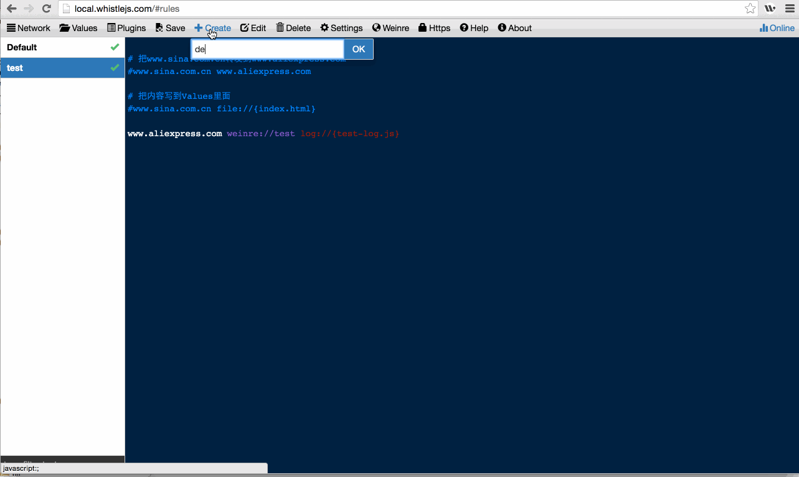

# Rules
规则配置界面：

1. `Create`：创建规则分组
2. `Delete`：删除分组
3. `Edit`：重命名分组
4. `Settings`：
 - `Theme`：设置主题
 - `Font size`：设置字体大小
 - `Show line number`：是否显示行数
 - `Allow multiple choice`：是否允许多选
 - `Disable all rules`：是否禁用所有规则，包括插件的规则
 - `Disable all plugins`：是否禁用插件规则
 - `Synchronized with the system hosts`：是否把配置同步到本地的hosts文件(需要root权限)
 - `Import system hosts to Default`：导入本地的hosts配置到Default分组(需要root权限，且会覆盖原来的配置)

