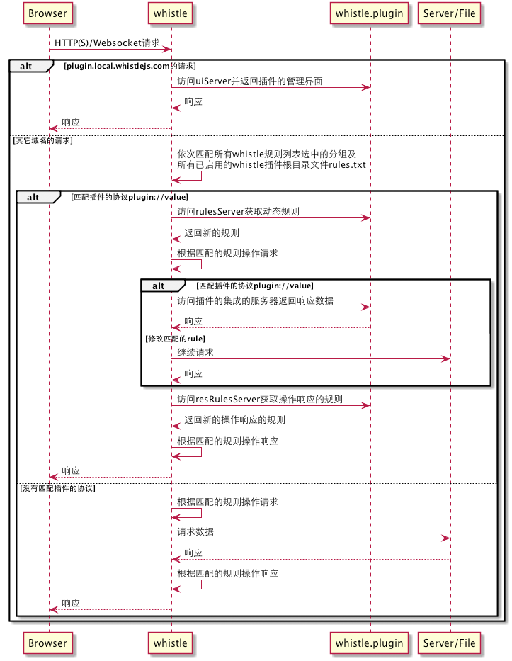

# 插件开发

有些功能用的比较少的功能，及一些跟业务相关的功能，如：

- 查看websocket的传输内容 
- 查看如图片等富媒体资源
- 集成一些本地服务(处理[combo请求](https://github.com/whistle-plugins/whistle.tianma))
- 动态设置规则(通过远程服务器动态判断请求设置哪些规则)
- 加载本地指定的规则文件

等等，考虑到会导致安装过程比较长或者占用内存空间或者适应范围比较小，whistle没有把这些功能加进去，但提供了插件的方式扩展这些功能。

whistle插件本身就是一个普通的Node模块，只是名字要按照`whistle.xxx`的形式命名，其中`xxx`指插件的名称且只能包含小写字母、数字、_、-四种字符，如：[whistle.helloworld](https://github.com/whistle-plugins/whistle.helloworld)、[whistle.tianma](https://github.com/whistle-plugins/whistle.tinama)、[whistle.vase](https://github.com/whistle-plugins/whistle.vase)，而`xxx`就是扩展的协议，可以直接在Rules里面配置使用，我们先看下whistle的时序图及插件的结构，了解whistle如何加载执行插件，然后再讲下如何开发、发布、安装插件。

whistle的时序图：

whistle插件目录结构：

	whistle.xxx
		|__ package.json
		|__ rules.txt
		|__ _rules.txt
		|__ index.js
		|__ lib
			  |__ uiServer.js
			  |__ rulesServer.js
			  |__ server.js
			  |__ resRulesServer.js
			  
除了package.json，其它都是可选的，其中(参考时序图)：

- package.json

		{
		    "name": "whistle.xxx",
		    "version": "0.0.1",
		    "description": "xxxx",
		    "homepage": "插件的帮助或官网链接",
		    //others
		}

- rules.txt: 插件的全局规则，只要插件启用，所有请求都会查找匹配
- _rules.txt: 插件的私有规则，只有请求匹配插件的规则`xxx://value`，才会去查找匹配
- index.js

		module.exports = require('./lib/server');
		module.exports.uiServer = require('./lib/uiServer');
		module.exports.rulesServer = require('./lib/rulesServer');
		module.exports.resRulesServer = require('./lib/resRulesServer');

- lib/uiServer: `xxx.local.whistlejs.com`域名下的请求都会直接访问该server，可用于后台管理界面

		module.exports = function(server, options) {
			/*
			* options包含一些自定义的头部字段名称及配置信息，后面单独统一讲
			* server是whistle传给插件的http.Server对象，
			* 开发者通过监听server的相关事件处理ui相关的请求(http或websocket)
			*/
		};

- lib/rulesServer: 规则服务器，请求只要匹配了插件的协议规则`xxx://value`，就会把一些请求带放在头部请求该server，该server可以根据需要返回新的规则

		module.exports = function(server, options) {
			/*
			* options包含一些自定义的头部字段名称及配置信息，后面单独统一讲
			* server是whistle传给插件的http.Server对象，
			* 开发者通过监听server的request事件获取请求信息，
			* 并返回新的规则
			*/
		};
	
- lib/server: 处理请求的server，可以做请求合并等，返回的数据就是请求的响应数据

		module.exports = function(server, options) {
			/*
			* options包含一些自定义的头部字段名称及配置信息，后面单独统一讲
			* server是whistle传给插件的http.Server对象，
			* 开发者通过监听server的相关事件处理whistle转发过来的请求
			*/
		};

- lib/resRulesServer: 响应规则服务器，在请求响应后到达浏览器前whistle会把一些请求信息传给该server，该server可以返回新的规则

		module.exports = function(server, options) {
			/*
			* options包含一些自定义的头部字段名称及配置信息，后面单独统一讲
			* server是whistle传给插件的http.Server对象，
			* 开发者通过监听server的request事件获取响应信息，
			* 并返回新的处理响应的规则
			*/
		};

- options

		{
			name: // ,
			RULE_VALUE_HEADER: // ,
			SSL_FLAG_HEADER: // ,
			FULL_URL_HEADER: // ,
			REAL_URL_HEADER: // ,
			NEXT_RULE_HEADER: // ,
			REQ_ID_HEADER: // ,
			DATA_ID_HEADER: // ,
			STATUS_CODE_HEADER: // ,
			LOCAL_HOST_HEADER: // ,
			HOST_PORT_HEADER: // ,
			METHOD_HEADER: // ,
			debugMode: // ,
			config: // 包括whistle的端口号port等一系列whistle的配置,
			storage: //提供本地存储的接口，用法参考：https://github.com/avwo/whistle/blob/master/lib/rules/util.js
		}
		
whistle插件的每部分都可以独立存在，各个部分的关系及与whistle的关系可以看时序图，也可以参考其它参加的实现方式：[https://github.com/whistle-plugins](https://github.com/whistle-plugins)，[whistle.helloworld](https://github.com/whistle-plugins/whistle.helloworld)

