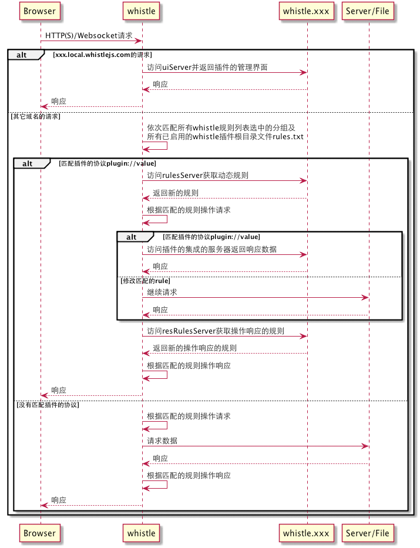

# 插件开发

有些功能用的比较少，且会导致安装过程比较长或者占用内存空间，还有一些跟业务相关的功能，如：

- 查看websocket的传输内容 
- 查看如图片等富媒体资源
- 集成一些本地服务(处理[combo请求](https://github.com/whistle-plugins/whistle.tianma))
- 动态设置规则(通过远程服务器动态判断请求设置哪些规则)
- 加载本地指定的规则文件

等等，whistle没有内置这些功能，但提供了插件的方式扩展这些功能。

whistle插件是名字形如`whistle.plugin`(`plugin`只能为小写字母、数字、_、-)的Node模块，其中名字`plugin`就是插件扩展的协议，我们先看下whistle的流程图了解下whistle如何加载执行插件，然后在详细说明下如何开发、发布、安装插件。

